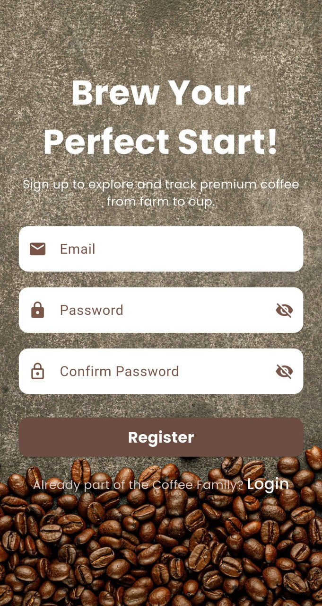
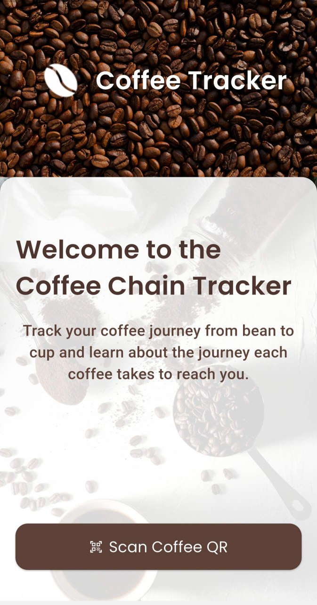
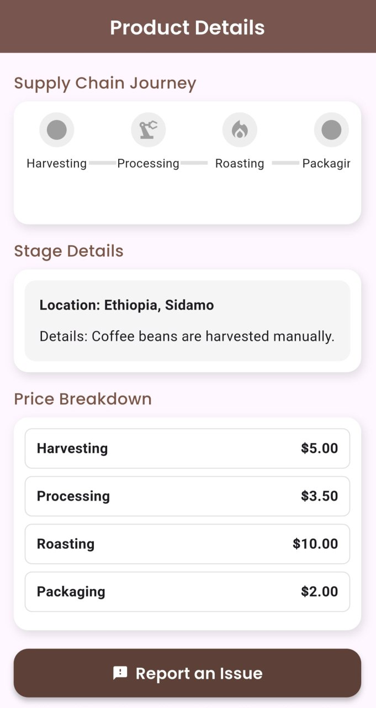
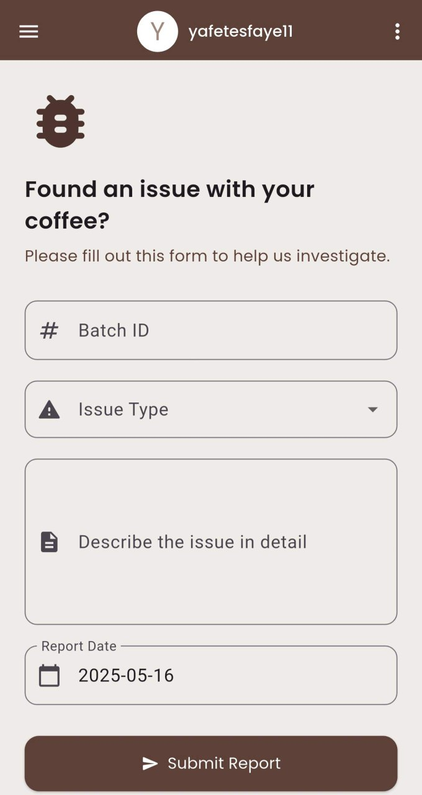

# 🌱 BeanChain - Coffee Supply Chain App

BeanChain is a blockchain-integrated mobile app that helps users trace the origin of their coffee from farm to cup by scanning a QR code. Built with Flutter and Firebase, it ensures transparency from producers to consumers.

---

## 🚀 Features

- 📷 Scan QR codes on coffee packages
- 🧑‍🌾 Track farming, manufacturing, and pricing data
- 📝 Submit issue reports and feedback on products
- 🔐 User authentication via email
- ☁️ Firebase backend integration

---

## 📱 Screenshots

### 🟢 Splash & Login
  

### 🏠 Home & Product Details
  

### 📝 Issue Reporting


---

## 🔧 Tech Stack

- **Flutter** – Frontend framework
- **Firebase** – Authentication, Firestore, Storage
- **REST API** – For retrieving QR-linked coffee data

---

## 📦 Installation

```bash
git clone https://github.com/yourusername/beanchain.git
cd beanchain
flutter pub get
flutter run
